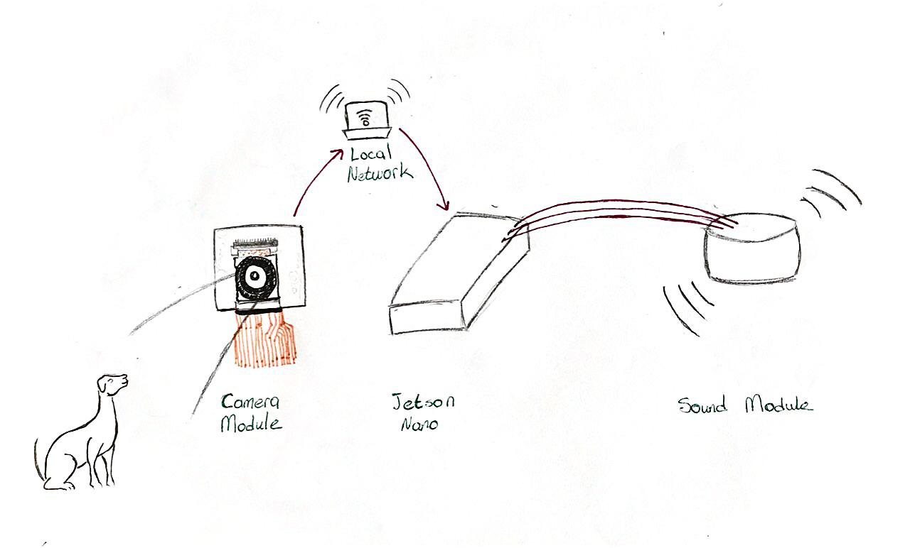

# smart-dog-deterrent-system
 Smart dog deterrence system that uses sound to keep dogs out of restricted areas like food canteens and libraries, applying the Jetson Nano's object detection capabilities with camera streams.


This project uses YOLOv5 for object detection to dog with custom database. It's built using the YOLOv5 model, which is a state-of-the-art object detection system from Ultralytics.


 <!-- Adjust the width as needed -->

Copyright (C) 2024 Bilge Urçuk, Erman Utku Avşar, Görkem Gümüşboğa


    This program is free software: you can redistribute it and/or modify
    it under the terms of the GNU Affero General Public License as published by
    the Free Software Foundation, either version 3 of the License, or
    (at your option) any later version.

    This program is distributed in the hope that it will be useful,
    but WITHOUT ANY WARRANTY; without even the implied warranty of
    MERCHANTABILITY or FITNESS FOR A PARTICULAR PURPOSE.  See the
    GNU Affero General Public License for more details.

    You should have received a copy of the GNU Affero General Public License
    along with this program.  If not, see <https://www.gnu.org/licenses/>.

You can reach us from bilgeurcukk@gmail.com

## Installation
To set up this project, follow these steps:
```bash
git clone https://github.com/yourgithub/reponame.git
cd reponame
pip install -r requirements.txt

